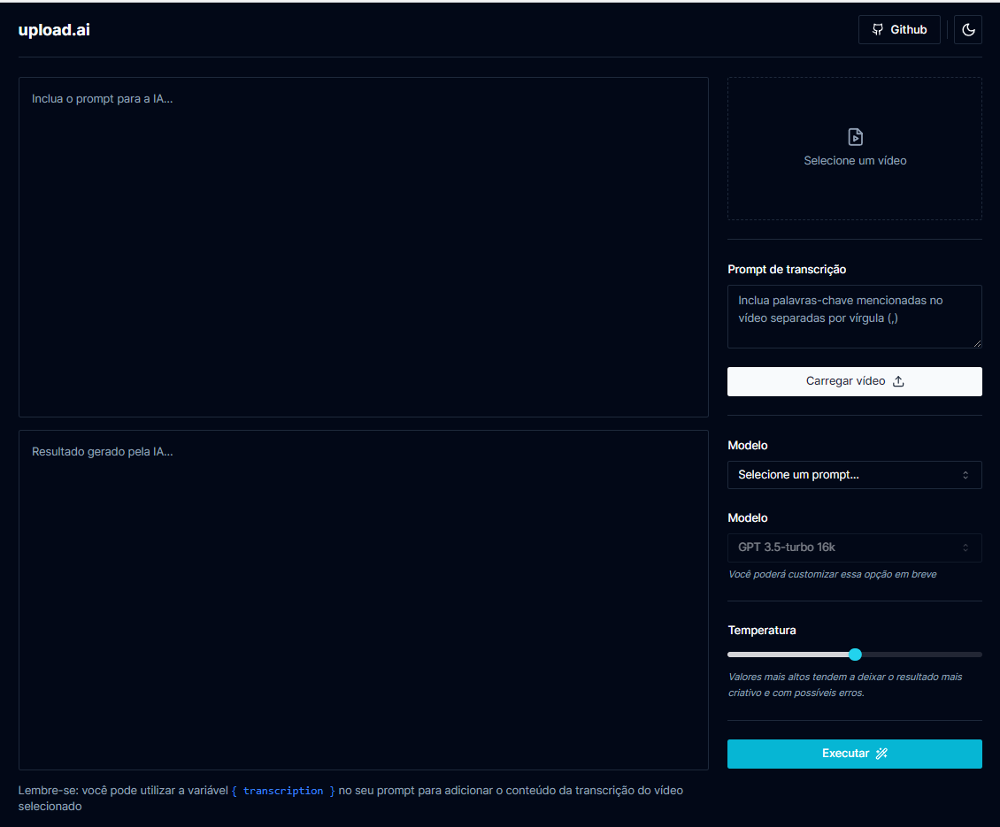
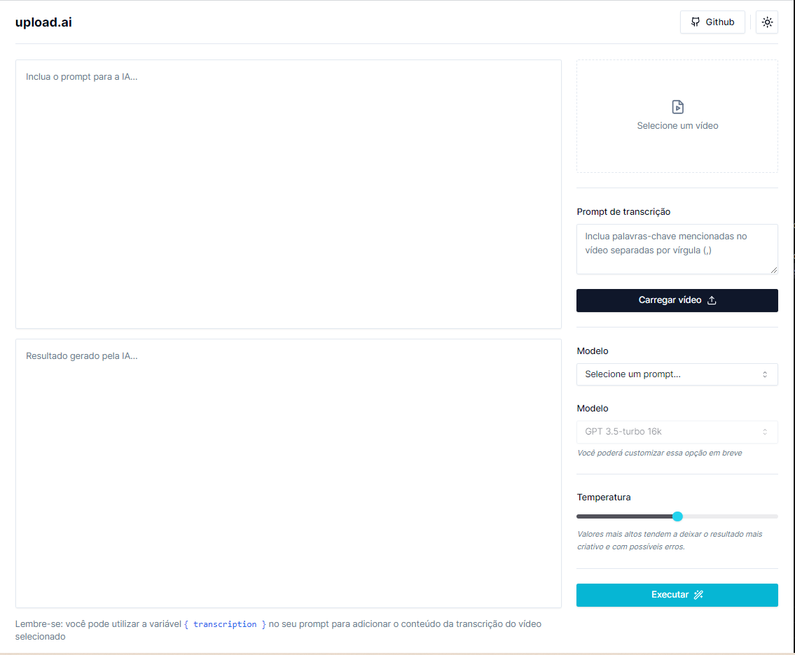
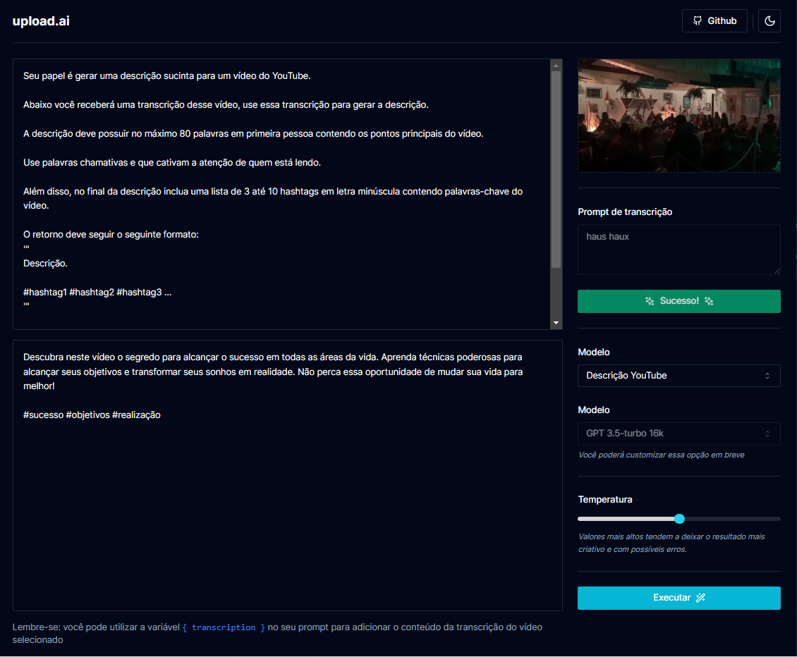

# Projeto NLW IA 09-2023 com Nestjs e Nestjs

##🌟 Sobre o Projeto

Este é um projeto alternativo ao repositório [NLW AI Mastery](https://github.com/rocketseat-education/nlw-ai-mastery/tree/main) da Rocketseat. Ele foi recriado usando [Nestjs](https://nestjs.com/) e [Nextjs 13](https://nextjs.org/blog/next-13) para oferecer uma abordagem diferente ao desenvolvimento de aplicações de IA.

## 📚 Sobre a Rocketseat

A Rocketseat é uma plataforma de educação em tecnologia que oferece uma gama completa de programas e eventos para ajudar desenvolvedores a evoluir rapidamente na carreira. Aqui estão alguns dos principais pontos que destacam a Rocketseat:

### 🚀 Formação Completa
A Rocketseat oferece programas que vão desde a introdução à programação até a especialização em tecnologias específicas. Você pode começar do zero e avançar até conquistar suas primeiras oportunidades na área.

### 🚀 Especialização em Stacks de Ponta
A plataforma oferece programas de especialização, como o Ignite, que focam em tecnologias amplamente utilizadas e valorizadas no mercado, como React, React Native e Node.js.

### 🚀 Aulas Avançadas e Cases Reais
Além de aulas teóricas, a Rocketseat oferece a oportunidade de aprender na prática, explorando casos reais e desenvolvendo aplicações de alto nível.

### 🚀 Fórum Exclusivo e Suporte
A Rocketseat possui um fórum exclusivo onde você pode tirar dúvidas técnicas de forma estruturada e receber suporte da comunidade e da equipe da Rocketseat.

### 🚀 Eventos e Imersões
A Rocketseat também organiza eventos online e presenciais, como o NLW (Next Level Week), para oferecer uma imersão prática em programação.

### 🚀 Comunidade Ativa
A Rocketseat tem uma comunidade muito ativa e engajada, o que facilita o networking e a troca de experiências.

## ⚡ Licença

Este projeto está sob a licença MIT. Veja o arquivo [LICENSE](LICENSE) para mais detalhes.

---

Feito com 🖤 por Andre Davila
